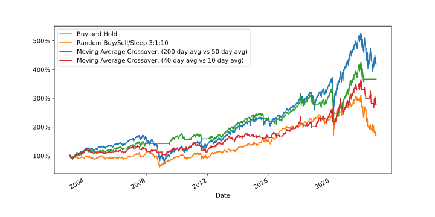

# Trading strategies plot

Plots how different trading strategies would have performed
on historical data.



Currently implemented strategies:
- buy and hold
- buy and sell randomly

## Assumptions

The main purpose of these plots is to see if stupidly
simple strategies will (roughly) outperform professionally
managed funds. Therefore some assumptions and
simplifications are made:

 - Assumes no trading fees on transactions.
 - Assumes that you're buying and selling the entire index.
(subject to change)

## Run

### Linux / MacOS

#### bash/zsh/sh
```sh
# Setup venv
python -m venv venv
source venv/bin/activate
pip install -r requirements.txt

# Run
./plot.py

# deactivate venv
deactivate
```

### Windows

#### PowerShell
```ps1
# Setup venv
python -m venv venv
. .\venv\Scripts\activate.ps1
python -m pip install -r requirements.txt

# Run
python .\plot.ps1

# Deactivate venv
deactivate
```

#### cmd.exe
```cmd
: Setup venv
python -m venv venv
venv\Scripts\activate.bat
pip install -r requirements.txt

: Run
python plot.py

: deactivate venv
deactivate
```
